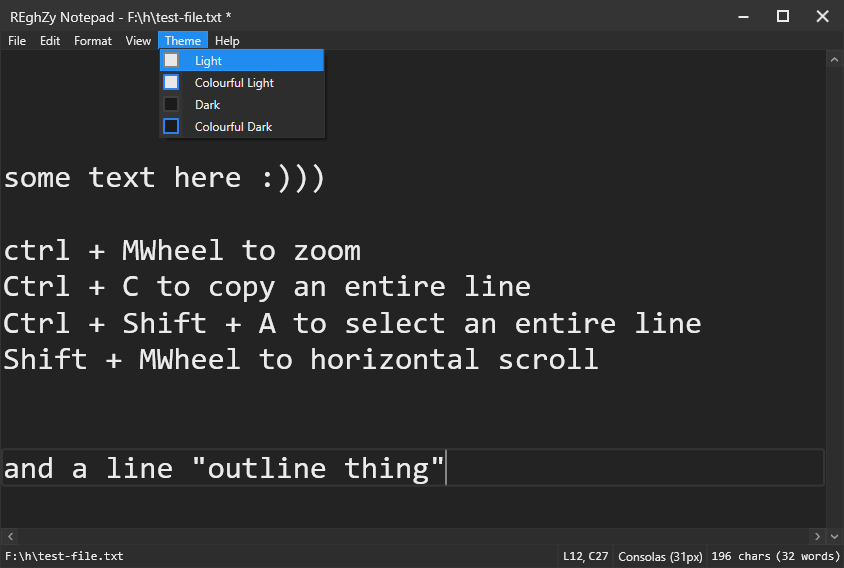

# REghZyNotepad
A simple replica of windows notepad but with a dark theme and more features (MVVM i think)

Preview of the dark theme (there's a light theme too)

This is basically notepad, only without the finding feature (not yet atleast) but extra useful features like:
- CTRL + C to copy an entire line (if you haven't selected any text)
- CTRL + X to cut an entire line (if you haven't selected any text)
- CTRL + Shift + A to select an entire line
- Horizontal scrolling when holding shift
- Zoom/change font size when holding CTRL and scrolling (slightly buggy if you're not at the bottom of the text editor)
- and more

Also the text wrapping option is broken... forgot to bind it in the FormatWindow.xaml... whoops
